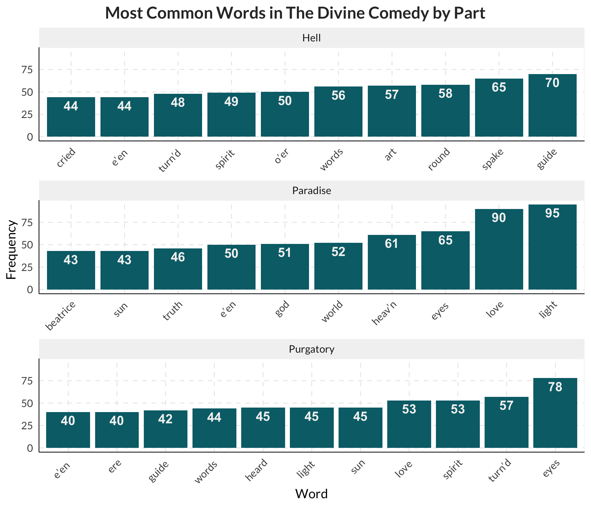

Exploring “The Divine Comedy”: A Textual Analysis
================
Javier Mtz.-Rdz.

## Setup

To begin with, we need to load the following packages for this
assignment.

``` r
library(tidytext)
library(tidyverse)
library(mytidyfunctions)
```

## Data Cleaning

In this step, we download and clean the text of [“The Divine Comedy” by
Dante Alighieri from the Project
Gutenberg](https://dev.gutenberg.org/ebooks/8800).

``` r
# Download the text of "The Divine Comedy" by Dante Alighieri. 
book <- read.table("https://dev.gutenberg.org/cache/epub/8800/pg8800.txt",
                   sep =  "\t",
                   skip = 156, 
                   nrows = 14015) %>% # This lines carefully avoid the metadata. 
  rename(txt = 1) 

# Clean the book data
book_clean <- book %>% 
  mutate(all_upp = ifelse(str_to_upper(txt) == txt, txt, NA),
         part = ifelse(str_detect(all_upp, "CANTO"), NA, all_upp),
         part = recode(part, "OR THE INFERNO" = "HELL"),
         canto = ifelse(str_detect(all_upp, "CANTO"), all_upp, NA)) %>% 
  fill(part, canto) %>% 
  filter(is.na(all_upp)) %>% 
  select(-all_upp)

# Tokenize the text
words <- book_clean %>% 
  unnest_tokens(word, txt)
```

## Stopwords remotion

In this phase, stop words are loaded and removed from the tokenized
book. It is worth noting that two sources of stop words are used. The
first source is the list from
[tidytext](https://github.com/juliasilge/tidytext). However, Alighieri’s
book contains many old stop words not available in the tidytext’s list.
For that reason, the [Stephen Wittek’s (MacGill) early modern
stopwords](http://earlymodernconversions.com/computer-based-textual-analysis-and-early-modern-literature-notes-on-some-recent-research/)
were also incorporated.

``` r
# Load stop words from the tidytext package and an additional source
old_sw <- read.table("http://earlymodernconversions.com/wp-content/uploads/2013/12/stopwords.txt",
                   sep =  " ") %>% 
  rename(word = 1) %>% 
  unnest_tokens(word, word) 

tdy_txt_sw <- tibble(tidytext::stop_words)

sw <- tdy_txt_sw %>% 
  full_join(old_sw, by = "word") 

# Remove stop words
filtered_words <- anti_join(words, sw)
```

    ## Joining with `by = join_by(word)`

## Plot of most common words by part of “The Divine Comedy”

Here, the most common words in “The Divine Comedy” are extracted and
visualized by part.

``` r
# Extract the most common words
top_words <- filtered_words %>%
  group_by(part) %>% 
  count(word, sort = TRUE) %>%
  top_n(10) %>% 
  ungroup() %>% 
  mutate(rep_word = 1,
         rep_word = cumsum(rep_word),
         word_s = paste0(word, str_dup(" ", rep_word - 1)),
         .by = word)
```

    ## Selecting by n

``` r
# Plot the most common words
ggplot(top_words, aes(x = fct_reorder(word_s, n), y = n)) +
  facet_wrap(~str_to_sentence(part),
             ncol = 1,
             scales = "free_x") +
  geom_col(fill = "#006D77") +
  geom_text_bi(aes(label = n),
               fontface = "bold") +
  labs(title = "Most Common Words in The Divine Comedy by Part",
       x = "Word",
       y = "Frequency") +
  mi_tema(axis.text.x = element_text(angle = 45, hjust = 1))
```

<!-- -->
